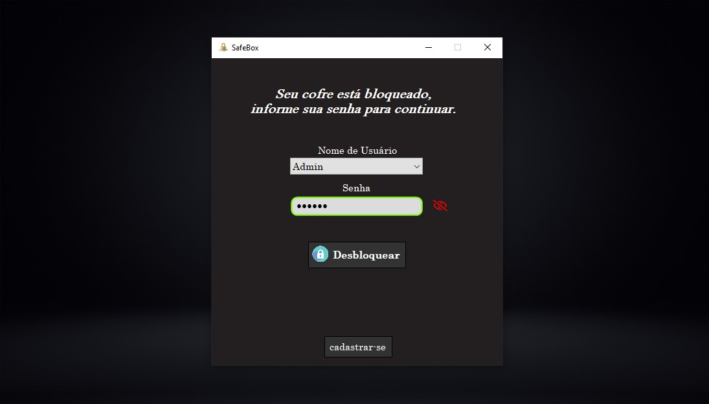
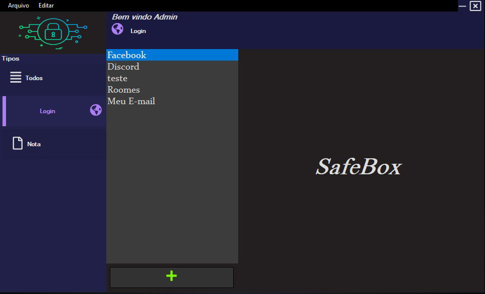
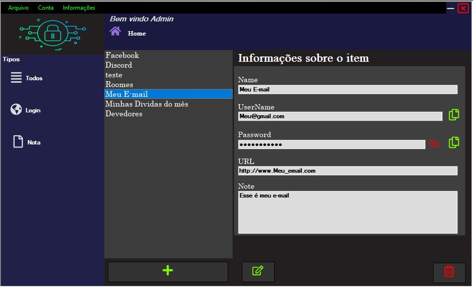

# SafeBox
SafeBox é uma gerenciador de senhas capas de gerenciar, criar, atualizar, armazenar e preencher diversos campos como: Login, senhas, cartões de crédito e notas privadas.
Funciona da seguinte forma: você cria um login e senha mestra para logar no sistema, em seguida já pode salvar seus dados.
  

      (Projeto em Desenvolvimento)

 

#
### Tela De Login

    

Se já tem um cadastro no sistema escolha seu nome de usuário e confirme sua senha, caso contrário clique em "Cadastrar-se".

 

### Tela Principal

    

Onde terá as opções de inserção, visualização de logins, notas privadas ...

 

### Tela de Cadastro

    

Usuário irá informar nome de usuário e senha.
 Validação de senha:
<ol>
    <li>Nova senha deve conter no mínimo 6 caracteres.</li>
    <li>Nova senha deve conter um caracter maiúsculo.</li>
    <li>Nova senha deve conter um caracter especial(simbolo).</li>
    <li>Nova senha não pode ser "Inaceitável", na verificação de força da senha.</li>
</ol>
Botão "Verificar Força da Senha" : Verifica a nova senhas informada e retorna um status de sua força podendo ser Inaceitavel, Fraca, Forte e Segura. 

 

### Tela Visualizar Item Cadastrado

    

Clicando sobre o  item terá acesso as informações salvas, opção de editar e deletar.

 

### Tela Configuração De Conta

    

Onde terá a opção de editar o nome de usuário, e troca de senha, com as seguintes validações:
<ol>
    <li>Senha atual deve ser informada corretamente.</li>
    <li>Nova senha deve conter no mínimo 6 caracteres.</li>
    <li>Nova senha deve conter um caracter maiúsculo.</li>
    <li>Nova senha deve conter um caracter especial(simbolo).</li>
    <li>Nova senha não pode ser "Inaceitável", na verificação de força da senha.</li>
</ol>
Botão "Verificar Força da Senha" : Verifica a nova senhas informada e retorna um status de sua força podendo ser Inaceitavel, Fraca, Forte e Segura. 
  
Botão "Deletar Conta" : Deleta sua conta e todos seus items salvos.
validação para deletar: 
    <li>Senha atual deve ser informada corretamente.</li>

 

### Tela Informações

    

 

#
## 🔧Técnologias
Esse projeto foi desenvolvido com as seguintes tecnologias:

### Principais Stacks:
- C# Windows Forms (.NET Framework)
- SQL Server

 

#
## ☕ Contatos
 você vai me encontrar em qualquer uma das redes sociais abaixo:

